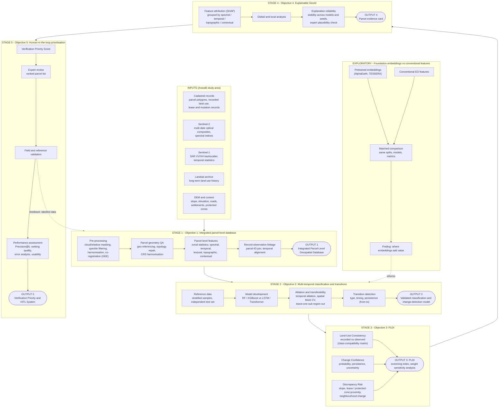

# Explainable GeoAI for Parcel-Level Land-Use Verification

### Integrating multi-temporal Earth observation and cadastral data to detect land-use discrepancies in the Aravalli Range


> Land records say what a parcel is *supposed* to be. Satellites show what is *actually* happening on it. This project is about the gap between the two.

**Author:** Neetu

**Keywords:** explainable GeoAI · cadastral parcels · land-use discrepancy · multi-temporal Earth observation · change detection · human-in-the-loop verification · Aravalli Range

> **Important:** This study is built as **decision support**. It never declares a parcel illegal. It only tells a human officer which parcels are worth a visit, and why.

---

## Table of Contents

- [TL;DR](#tldr)
- [Abstract](#abstract)
- [1. Introduction](#1-introduction)
- [2. Problem Statement](#2-problem-statement)
- [3. Objectives and Deliverables](#3-objectives-and-deliverables)
- [4. Proposed Framework](#4-proposed-framework)
- [5. The Four Parcel-Level Scores](#5-the-four-parcel-level-scores)
- [6. Research Phases (5-Year Plan)](#6-research-phases-5-year-plan)
- [7. Data Sources](#7-data-sources)
- [8. Literature Review (Summary)](#8-literature-review-summary)
- [9. Research Gap](#9-research-gap)
- [10. Planned Repository Structure](#10-planned-repository-structure)
- [11. Limitations and Responsible Use](#11-limitations-and-responsible-use)
- [12. References](#12-references)
- [13. Citation and License](#13-citation-and-license)

---

## TL;DR

| | |
|---|---|
| **Problem** | Cadastral records and ground reality drift apart. Revenue and enforcement offices have thousands of parcels and very few people, so most mismatches are never checked. |
| **Idea** | Compare the *recorded* land use of every parcel with the land use *observed* from multi-temporal satellite data, then return a short ranked list of parcels to visit, with evidence. |
| **Inputs** | Cadastral parcels + Sentinel-1, Sentinel-2, Landsat, terrain/context layers |
| **Outputs** | 4 parcel-level scores, evidence cards, a ranked verification list, a feedback loop |
| **Explainability** | SHAP (feature-based models), Grad-CAM / attention maps (deep models) |
| **Case study** | Aravalli Range (mining, urban expansion, agriculture and infrastructure all pressing together) |
| **Extension** | Pretrained geospatial embeddings (AlphaEarth, TESSERA) as an *exploratory* add-on, so the core thesis does not depend on them |

---

## Abstract

Land-use change, unauthorised development, encroachment, mining expansion and conversion of environmentally sensitive land are major challenges for land governance. Land records tell us what a parcel is supposed to be used for. Satellites show what is actually happening on it. In fast-changing landscapes the two drift apart, and the gap is where unauthorised construction, encroachment, illegal mining and quiet conversion of sensitive land tend to hide. Field verification is the traditional answer, but revenue and enforcement offices have thousands of parcels and very few people, so most of these mismatches are never looked at.

This research proposes an explainable GeoAI framework that compares the recorded land use of each cadastral parcel with land use observed from multi-temporal Earth observation data (Sentinel-1, Sentinel-2, Landsat and terrain), and returns a short, ranked list of parcels that deserve a human visit, along with the evidence for each flag. Four parcel-level scores are designed for this purpose: a **Land-Use Consistency Score**, a **Change Confidence Score**, a **Discrepancy Risk Score** and a **Verification Priority Score**. Explanations are produced with SHAP for feature-based models and Grad-CAM or attention maps for deep models, and are turned into visual evidence cards that a non-technical officer can read. A human-in-the-loop workflow lets officers confirm, dismiss or query each flag, and those decisions are fed back to improve the model.

The Aravalli Range is the case study because mining, urban expansion, agriculture and infrastructure all press on it at once, and because land records exist but are largely unverified. The work is organised in six phases over five years: literature and data feasibility, a parcel-level geospatial database, a baseline classification and change-detection model with a temporal ablation and a transferability test, an explainability layer, a verification workflow with feedback, and field validation. Pretrained geospatial embeddings (AlphaEarth, TESSERA) are treated as an exploratory extension. The system is designed as decision support. It does not declare any parcel illegal.

---

## 1. Introduction

### 1.1 Background and motivation

Good land governance depends on records that match reality. A revenue department that knows which parcels are farmland, which are forest, which are permitted for construction and which are leased for mining can plan, tax, protect and enforce. When the record and the ground disagree, everything downstream becomes harder. Land-use change, unauthorised development, encroachment, mining expansion and the conversion of environmentally sensitive land are all, at their core, cases where **the ground has moved and the record has not**.

Most monitoring today still relies on field inspections, periodic surveys and complaints. These are slow, expensive and hard to scale across large, uneven landscapes. Satellite data can watch every parcel at regular intervals for free, and machine learning can read it faster than any team of people. But most published remote sensing work stops at land-cover maps or change maps. A change map says *that* something changed at a location. It does not say:

- whether that change is inconsistent with what the record permits,
- how sure we are,
- why the model thinks so,
- or which of the thousand flagged places an officer should visit first.

That last mile, from pixels to a defensible, prioritised, explained list of parcels, is what this research is about. Explanation matters more here than in most remote sensing applications because the setting is legal and administrative. A field officer cannot act on "an AI system said so". They need a reason they can check with their own eyes and defend in a file note.

### 1.2 Why the Aravalli Range?

The Aravalli Range is among the oldest mountain systems in the world and stretches across Delhi, Haryana, Rajasthan and Gujarat. It acts as a barrier against desertification, recharges groundwater and supports a large amount of biodiversity. It is also under heavy pressure. Published studies describe forest loss, expanding cultivation, mining and urban growth across the range (*Earth Science Informatics*, 2022), and a recent assessment reports that non-metallic mining in particular changes the geomorphology and ecology of the landscape, with lease growth accelerating around 2015 to 2017 (*Geographies*, 2026). The exact geographical scope of the range has itself been the subject of legal debate, which makes reliable, parcel-level evidence more valuable, not less.

For a study of record-versus-reality mismatch, the Aravalli is close to an ideal stress test:

- several kinds of discrepancy occur in the same region (mining expansion, built-up encroachment, vegetation loss),
- the terrain is varied,
- land records are available but unverified.

If a framework works here, with heterogeneous data and mixed pressures, it has a fair chance of being useful elsewhere.

---

## 2. Problem Statement

Land governance has a **verification gap**. What the cadastral record says about a parcel and what a satellite observes on it often disagree, and manual verification does not scale to the number of parcels involved.

Current practice and current research face these problems:

- Land records and remotely sensed observations are maintained separately and are rarely compared systematically.
- Conventional land surveys are expensive and slow, and field officers must cover thousands of parcels with limited staff.
- Most satellite-based LULC studies work at pixel or image level, not at the parcel level where records and enforcement actually operate.
- Many AI models detect change without saying *why* a location was flagged, which is not acceptable in a legal or enforcement setting.
- Land-use change is often gradual and is hard to see in single-date imagery.
- Different pressures (urbanisation, mining, vegetation loss) call for an integrated view rather than separate one-off studies.

**What is needed:** a parcel-level, multi-temporal and explainable framework that connects observed land-use change with land-record information, compares recorded and observed use automatically, and produces explained, risk-prioritised alerts for human-led verification.

---

## 3. Objectives and Deliverables

### Core objectives

| # | Objective | What it delivers |
|---|-----------|------------------|
| **O1** | Build an integrated parcel-level geospatial database by linking cadastral records with multi-temporal Earth observation data | Spatial, spectral, temporal, topographic and contextual information per parcel (Sentinel-1, Sentinel-2, Landsat, DEM), with historical land-use records linked to remotely observed land use. This is the foundation for everything else. |
| **O2** | Build a multi-temporal GeoAI framework for parcel-level land-use classification and transition detection | Detects changes in vegetation, built-up, bare land, water, mining and other classes. Compares ML and DL approaches. Includes a **temporal ablation** (which time periods actually help?) and a **transferability test** (does it work in other parts of the study area?). |
| **O3** | Build a **Parcel-Level Land-Use Discrepancy Index (PLDI)** | Quantifies the difference between recorded and observed land use using three components: Land-Use Consistency, Change Confidence and Discrepancy Risk. A screening index, not a legal classification. |
| **O4** | Build an explainable GeoAI layer | Shows which spatial, spectral, temporal, topographic and contextual factors drove each flag. Output is a simple **parcel evidence card**: recorded vs observed use, nature and timing of change, key factors, model confidence, supporting imagery. |
| **O5** | Build and validate a human-in-the-loop decision-support framework | A **Verification Priority Score (VPS)** built from discrepancy magnitude, model confidence, persistence of change, environmental sensitivity and spatial context. Field feedback is used to evaluate and improve the model. Validated against independent reference data and, where possible, field observations. |

### Exploratory objective

**E1:** Compare pretrained geospatial foundation embeddings with conventional Earth observation features for parcel-level land-use characterisation.

The question is not just "do embeddings improve accuracy?". It is also *where* they add information, *where* conventional features (spectral, temporal, textural, terrain) do just as well, and *under what conditions* their advantage disappears. Same splits, same models, same metrics.

### Major deliverables

- [ ] Integrated Parcel-Level Geospatial Database
- [ ] A validated baseline classification and change-detection model
- [ ] Parcel-Level Land-Use Discrepancy Index (PLDI)
- [ ] Explainable Parcel-Level Evidence Framework
- [ ] Verification Priority and Human-in-the-Loop System

---

## 4. Proposed Framework

The framework takes two kinds of input: cadastral parcels with their recorded land-use category, and a multi-temporal stack of Earth observation data. It runs as a chain:

1. Estimate observed land use for each parcel at several dates.
2. Detect changes between dates in two independent ways.
3. Compare the observed state and detected change with the recorded category.
4. Compute four scores.
5. Explain each flagged parcel.
6. Present ranked, explained alerts on a dashboard. The reviewer's decision goes back into the database as new labelled data.



---

## 5. The Four Parcel-Level Scores

| Score | What it answers | Built from |
|-------|-----------------|------------|
| **Land-Use Consistency Score** | Does the observed use agree with the recorded use? | Recorded vs observed class, via a class-compatibility matrix (a documented crosswalk from cadastral categories to observable classes) |
| **Change Confidence Score** | How sure are we that a real transition happened? | Class probability, temporal persistence, model uncertainty, and **agreement between post-classification comparison (PCC) and change vector analysis (CVA)**, since the two methods fail in different ways |
| **Discrepancy Risk Score** | How much does this discrepancy matter in context? | Slope, proximity to leases and protected zones, neighbourhood change |
| **Verification Priority Score (VPS)** | Which parcels should an officer visit first? | Discrepancy magnitude, model confidence, persistence of change, environmental sensitivity, spatial context |

The first three combine into the **PLDI**. Weight sensitivity analysis is part of the plan, so the final ranking does not depend on one arbitrary choice of weights. The VPS is evaluated with **Precision@k**, because the real question is "of the top k parcels an officer visits, how many were worth visiting?".

### Parcel evidence card (output for non-technical officers)

Each flagged parcel gets a card showing:

- recorded land use vs observed land use
- type and timing of detected change
- top contributing factors (grouped as spectral / temporal / topographic / contextual)
- model confidence
- the actual imagery and dates, so the officer can verify the claim by eye

---

## 6. Research Phases (5-Year Plan)

| Phase | Focus | Notes |
|-------|-------|-------|
| **1** | Literature and data feasibility | Three review tracks: (A) parcel-level LULC, (B) XAI in remote sensing, (C) cadastre + EO integration. Every paper logged with method, dataset, reported accuracy and gap. Also tests the claim that no existing framework combines all components. |
| **2** | Parcel-level geospatial database | Parcel QA, feature extraction, record-observation linkage. Includes explicit quantification of **parcel size vs 10 m pixel size** and per-size-class analysis rules. |
| **3** | Baseline classification and change detection | RF / XGBoost baseline vs deep temporal models. **Temporal ablation** against a matched single-date model. **Transferability test** on a reserved contrast area. |
| **4** | Explainability layer | SHAP, Grad-CAM / attention. Faithfulness and stability checks, not blind trust. Evidence cards. |
| **5** | Verification workflow with feedback | VPS, reviewer confirm / dismiss / query actions, feedback into training data. Explicitly handles **sampling bias** (officers only see the top of the ranking). |
| **6** | Field validation | Independent reference data (e.g. high-resolution imagery) and field checks. Precision@k, error analysis, usability. |

*Exploratory track (E1)* runs alongside Phases 3 and 4 and is not on the critical path.

---

## 7. Data Sources

| Data | Use |
|------|-----|
| Cadastral parcels and land records | Parcel polygons, recorded land use, lease and mutation records |
| Sentinel-2 (10 to 20 m, multispectral) | Multi-date composites, spectral indices (e.g. NDVI, NDBI) |
| Sentinel-1 (C-band SAR) | Cloud-independent backscatter (VV/VH), temporal statistics |
| Landsat archive | Long-term land-use history |
| DEM | Slope, elevation, terrain |
| Context layers | Roads, settlements, lease areas, protected zones |
| Dynamic World, ESA WorldCover | Context and weak labels at 10 m (class definitions do not map cleanly to cadastral categories) |
| AlphaEarth / Satellite Embedding V1 (annual, 10 m, 64-D) and TESSERA (10 m, 128 bands) | Exploratory embedding benchmark only |

**Platform:** Google Earth Engine for regional-scale stacks, Python for modelling, QGIS for parcel QA and mapping.

---

## 8. Literature Review (Summary)

**Track A: Parcel-level LULC.** The field has moved from per-pixel classifiers to object-based methods and then deep learning. Random forests remain a competitive, interpretable baseline (Breiman, 2001; Belgiu and Drăguţ, 2016), so the work starts there. Cadastral AI work focuses on *where the boundary is*, much less on whether the recorded *land-use category* of a known boundary still matches the ground. Yang et al. (2021) is the closest reference for consistent classification against a fine-grained catalogue, but uses object-level imagery rather than a multi-temporal medium-resolution stack and produces no prioritised, explained alerts.

**Multi-temporal change detection.** PCC gives clear from-to transitions but accumulates classification errors. CVA needs no classification but is sensitive to radiometric differences (Singh, 1989; Johnson and Kasischke, 1998; Bovolo and Bruzzone, 2007). Deep learning dominates now, but is mostly benchmarked on building or urban change with very high-resolution imagery. 10 m data in semi-arid hilly landscapes, judged against a *legal record*, is understudied. Because PCC and CVA fail differently, their agreement is a sensible confidence signal. Single-date imagery cannot separate seasonal conditions from permanent change (fallow field vs stripped land), which motivates the temporal ablation.

**Track B: Explainable AI in remote sensing.** SHAP (Lundberg and Lee, 2017), Grad-CAM (Selvaraju et al., 2017), attention maps. Reviews by Gevaert (2022) and Höhl et al. (2024) note that most XAI was designed for natural images, not multispectral, multi-temporal, spatially autocorrelated data. Rudin (2019) argues for inherently interpretable models in high-stakes settings, and example-based XAI work notes that importance methods do not by themselves give *evidence*. Design response here: start with a random forest, test explanation faithfulness and stability, and always pair explanations with actual imagery and dates. **What is missing:** explanations designed for a specific administrative user rather than for other researchers.

**Track C: Cadastre + Earth observation.** Closest existing work targets unauthorised *buildings* (Ostankovich and Afanasyev, 2018; SAM prompted with cadastral centroids in Italian heritage settlements, 2025). These studies share a profile: buildings, very high-resolution or UAV imagery, footprint comparison, urban settings. This project differs in three ways: the discrepancy is often a change of *land-use category* (farmland to mine, forest to bare), the evidence is *spectral and temporal* at 10 m, and the setting is a hilly, ecologically sensitive landscape with several violation types to weigh against each other.

**Aravalli context.** Existing studies (CART + MLP-CA-Markov modelling; district-level mining maps for Gurgaon, Faridabad and Mewat; the 2026 *Geographies* land-degradation study) establish that pressures are real and measurable, but work at landscape or district scale and do not compare against parcel-level records.

**Foundation models and embeddings.** AlphaEarth (Brown et al., 2025) and TESSERA (Feng et al., 2025) are attractive but annual (limits sub-annual change detection) and their dimensions are not physically interpretable (sits uneasily with the explainability requirement). Whether they beat NDVI / NDBI / terrain features at parcel level is an open empirical question, hence the exploratory status.

**Decision support and human-in-the-loop.** Active learning (Tuia et al., 2009) picks the most informative samples for humans to label. Here the logic runs in reverse: pick parcels where a human visit is most valuable, then learn from the answer. Domain adaptation (Tuia et al., 2016) frames the transferability question. Accuracy assessment follows Olofsson et al. (2014). Direct literature on feedback loops between enforcement staff and land-monitoring models is thin, so it is treated as an open design problem.

### Synthesis: what exists, what is missing, how this research responds

| Theme | What the literature offers | Limitation for this problem | Response in this research |
|-------|---------------------------|----------------------------|---------------------------|
| Land-use classification | Mature ML/DL; RF as interpretable baseline; Sentinel + GEE workflows | Mostly pixel/image level; class schemes differ from cadastral categories | Parcel-level classification with documented crosswalk from recorded to observable classes |
| Parcel size vs pixel size | VHR solutions for boundary work | Rarely quantified for 10 m data | Explicit quantification and per-size-class analysis rules (Phase 2) |
| Change detection | PCC, CVA, many DL architectures | Each fails differently; benchmarks mostly urban and VHR | Two independent methods; agreement feeds Change Confidence Score |
| Use of time series | Many claims that multi-temporal input helps | Rarely tested against matched single-date model at parcel level | Temporal ablation study |
| Explainability | SHAP, Grad-CAM, attention; XAI-in-EO reviews | Explanations built for researchers; faithfulness concerns | Faithfulness tests + officer-oriented evidence cards |
| Cadastre + EO | Illegal building detection against cadastral maps | Buildings/footprints, VHR or UAV, urban | Land-use category discrepancy with 10 m multi-temporal data in mixed rural/mining/urban terrain |
| Prioritisation | Active learning in remote sensing | Not framed around limited inspection capacity | Verification Priority Score, evaluated with Precision@k |
| Generalisation | Domain adaptation research | Rarely tested within one mountain range | Bounded transferability test on a reserved contrast area |
| Foundation embeddings | AlphaEarth, TESSERA and others | Annual, hard to interpret, untested for parcel discrepancy | Exploratory benchmark against conventional features |

---

## 9. Research Gap

Existing land-monitoring approaches usually address land-cover classification **or** change detection. Land governance needs something more integrated:

1. decide whether observed change is **inconsistent with the recorded use** of a specific parcel,
2. understand the **evidence** behind that decision,
3. **prioritise** the limited human verification capacity that actually exists.

No work found so far joins these pieces into one deployment-realistic framework for a landscape like the Aravalli. This claim is based on a preliminary search and will be tested systematically in Phase 1.

---

## 10. Planned Repository Structure

> This is the intended layout for the code and data once implementation starts. Nothing below exists yet.

```text
.
├── README.md
├── docs/
│   ├── proposal.pdf
│   ├── literature_log_template.md      # Appendix A: per-paper logging template
│   └── class_crosswalk.md              # recorded land-use class -> observable class
├── data/
│   ├── raw/                            # cadastral parcels, downloaded EO (not tracked)
│   ├── interim/
│   └── processed/                      # parcel-level feature tables
├── gee/                                # Earth Engine scripts (S1, S2, Landsat, DEM)
├── notebooks/
│   ├── 01_parcel_qa.ipynb
│   ├── 02_feature_extraction.ipynb
│   ├── 03_classification_baseline.ipynb
│   ├── 04_change_detection_pcc_cva.ipynb
│   ├── 05_scores_pldi_vps.ipynb
│   └── 06_explainability.ipynb
├── src/
│   ├── features/
│   ├── models/                         # RF / XGBoost / LSTM / Transformer
│   ├── change/                         # PCC, CVA
│   ├── scoring/                        # consistency, confidence, risk, VPS
│   ├── explain/                        # SHAP, Grad-CAM, evidence cards
│   └── dashboard/                      # reviewer interface + feedback logging
├── experiments/
│   ├── temporal_ablation/
│   ├── transferability/
│   └── embeddings_vs_conventional/     # exploratory
├── reports/figures/
├── requirements.txt
└── LICENSE
```

---

## 11. Limitations and Responsible Use

- **Decision support only.** Outputs are screening flags. No parcel is declared illegal by this system.
- **Recorded classes do not map one-to-one to observable classes.** The class-compatibility matrix is a documented assumption and must be reviewed by domain experts.
- **10 m resolution limits small parcels.** Parcel size vs pixel size is quantified explicitly, with analysis rules per size class.
- **Seasonality can mimic change.** Hence the temporal ablation and persistence checks.
- **Embeddings are annual and hard to interpret.** They stay exploratory.
- **Explanations can be unfaithful.** SHAP and Grad-CAM outputs are tested for stability, not assumed correct.
- **Feedback loop bias.** Officers only visit top-ranked parcels, which skews the feedback data. Addressed explicitly in Phase 5.
- **Legal scope of the Aravalli** is itself contested, so study-area boundaries must be documented clearly.

---

## 12. References


**Journal articles, books and conference papers**

- Belgiu, M., & Drăguţ, L. (2016). Random forest in remote sensing: A review of applications and future directions. *ISPRS Journal of Photogrammetry and Remote Sensing*, 114, 24–31.
- Bovolo, F., & Bruzzone, L. (2007). A theoretical framework for unsupervised change detection based on change vector analysis in the polar domain. *IEEE TGRS*, 45(1), 218–236.
- Breiman, L. (2001). Random forests. *Machine Learning*, 45(1), 5–32.
- Brown, C. F., Brumby, S. P., Guzder-Williams, B., et al. (2022). Dynamic World, near real-time global 10 m land use land cover mapping. *Scientific Data*, 9, 251.
- Brown, C. F., Kazmierski, M. R., Pasquarella, V. J., et al. (2025). AlphaEarth Foundations: An embedding field model for accurate and efficient global mapping from sparse label data. arXiv:2507.22291.
- Crommelinck, S., Koeva, M., Yang, M. Y., & Vosselman, G. (2019). Application of deep learning for delineation of visible cadastral boundaries from remote sensing imagery. *Remote Sensing*, 11(21), 2505.
- Drusch, M., Del Bello, U., Carlier, S., et al. (2012). Sentinel-2: ESA's optical high-resolution mission for GMES operational services. *Remote Sensing of Environment*, 120, 25–36.
- Feng, Z., et al. (2025). TESSERA: Temporal embeddings of surface spectra for Earth representation and analysis. arXiv:2506.20380.
- Gevaert, C. M. (2022). Explainable AI for Earth observation: A review including societal and regulatory perspectives. *Int. J. Applied Earth Observation and Geoinformation*, 112, 102869.
- Gorelick, N., Hancher, M., Dixon, M., et al. (2017). Google Earth Engine: Planetary-scale geospatial analysis for everyone. *Remote Sensing of Environment*, 202, 18–27.
- Höhl, A., Obadic, I., Najjar, H., Dengel, A., et al. (2024). Opening the black-box: A systematic review on explainable AI in remote sensing. arXiv:2402.13791.
- Johnson, R. D., & Kasischke, E. S. (1998). Change vector analysis: A technique for the multispectral monitoring of land cover and condition. *Int. J. Remote Sensing*, 19(3), 411–426.
- Lundberg, S. M., & Lee, S.-I. (2017). A unified approach to interpreting model predictions. *NeurIPS*, 30.
- Ma, L., Liu, Y., Zhang, X., Ye, Y., Yin, G., & Johnson, B. A. (2019). Deep learning in remote sensing applications: A meta-analysis and review. *ISPRS Journal of Photogrammetry and Remote Sensing*, 152, 166–177.
- Nathalia, D., et al. (2018). Monitoring land use/cover changes during the mining activities in Aravalli Hill Region. † *(venue to be confirmed)*
- Olofsson, P., Foody, G. M., Herold, M., Stehman, S. V., Woodcock, C. E., & Wulder, M. A. (2014). Good practices for estimating area and assessing accuracy of land change. *Remote Sensing of Environment*, 148, 42–57.
- Ostankovich, V., & Afanasyev, I. (2018). Illegal buildings detection from satellite images using GoogLeNet and cadastral map. *IEEE* (Xplore document 8710565). †
- Roscher, R., Bohn, B., Duarte, M. F., & Garcke, J. (2020). Explainable machine learning for scientific insights and discoveries. *IEEE Access*, 8, 42200–42216.
- Rudin, C. (2019). Stop explaining black box machine learning models for high stakes decisions and use interpretable models instead. *Nature Machine Intelligence*, 1, 206–215.
- Selvaraju, R. R., Cogswell, M., Das, A., Vedantam, R., Parikh, D., & Batra, D. (2017). Grad-CAM: Visual explanations from deep networks via gradient-based localization. *ICCV*, 618–626.
- Singh, A. (1989). Digital change detection techniques using remotely-sensed data. *Int. J. Remote Sensing*, 10(6), 989–1003.
- Torres, R., Snoeij, P., Geudtner, D., et al. (2012). GMES Sentinel-1 mission. *Remote Sensing of Environment*, 120, 9–24.
- Tuia, D., Persello, C., & Bruzzone, L. (2016). Domain adaptation for the classification of remote sensing data: An overview of recent advances. *IEEE GRSM*, 4(2), 41–57.
- Tuia, D., Ratle, F., Pacifici, F., Kanevski, M. F., & Emery, W. J. (2009). Active learning methods for remote sensing image classification. *IEEE TGRS*, 47(7), 2218–2232.
- Yang, C., Rottensteiner, F., & Heipke, C. (2021). A hierarchical deep learning framework for the consistent classification of land use objects in geospatial databases. *ISPRS Journal of Photogrammetry and Remote Sensing*, 177, 38–56.
- Zanaga, D., Van De Kerchove, R., et al. (2022). ESA WorldCover 10 m 2021 v200. Zenodo. doi:10.5281/zenodo.7254221
- Zhu, X. X., et al. (2026). On the foundations of Earth foundation models. *Communications Earth & Environment*. †
- Zhu, X. X., Tuia, D., Mou, L., et al. (2017). Deep learning in remote sensing: A comprehensive review and list of resources. *IEEE GRSM*, 5(4), 8–36.

**Datasets**

- Google. Satellite Embedding V1 (annual). Earth Engine Data Catalog. `developers.google.com/earth-engine/datasets/catalog/GOOGLE_SATELLITE_EMBEDDING_V1_ANNUAL`

**Preliminary-search entries**

- Artificial intelligence in cadastre: A systematic review of methods, applications, and trends (2026). *Land*, 15(3), 411. doi:10.3390/land15030411 †
- Artificial intelligence in environmental and Earth system sciences: Explainability and trustworthiness (2025). *Artificial Intelligence Review*. doi:10.1007/s10462-025-11165-2 †
- Assessment of land-use dynamics of the Aravalli range (India) using integrated geospatial and CART approach (2022). *Earth Science Informatics*. doi:10.1007/s12145-021-00753-9 †
- Change detection in remote sensing imagery: A systematic review of statistical, machine learning, and deep learning methods (2026). *Remote Sensing*, 18(15), 2573. doi:10.3390/rs18152573 †
- Deep learning for change detection in remote sensing: A review (2022). *Geo-spatial Information Science*. doi:10.1080/10095020.2022.2085633 †
- Example-based explainable AI and its application for remote sensing image classification (2023). arXiv:2302.01526. †
- Exploring the potential of AlphaEarth and TESSERA embeddings for fine-scale local climate zone mapping: A case study across five cities in Switzerland (2026). arXiv:2606.20034. †
- Earth embeddings as products: Taxonomy, ecosystem, and standardized access (2026). arXiv:2601.13134. †
- Land use and land cover classification meets deep learning: A review (2023). *Sensors*, 23(21), 8966. doi:10.3390/s23218966 †
- Machine and deep learning for Sentinel-based land use and land cover change detection: A systematic review and future outlook (2026). *Environmental Monitoring and Assessment*. doi:10.1007/s10661-026-15558-w †
- Spatiotemporal study of land degradation impacting the oldest mountains of the Indian subcontinent (2026). *Geographies*, 6(1), 29. doi:10.3390/geographies6010029 †
- Study using the Segment Anything Model prompted with cadastral centroids to detect unauthorised buildings and cadastral discrepancies in Italian heritage settlements (2025). *ISPRS Archives*, XLVIII-M-9-2025, 1349. † *(full title and authors to be added)*

---

## 13. Citation and License

```bibtex
@misc{explainable_geoai_parcel_aravalli,
  title  = {Explainable GeoAI for Parcel-Level Land-Use Verification and Discrepancy Detection:
            Integrating Multi-Temporal Earth Observation and Cadastral Data in the Aravalli Range},
  author = {Neetu},
  year   = {2026},
  note   = {Research proposal}
}
```

**License:** to be decided (suggested: CC BY 4.0 for documentation, MIT or Apache-2.0 for code).
